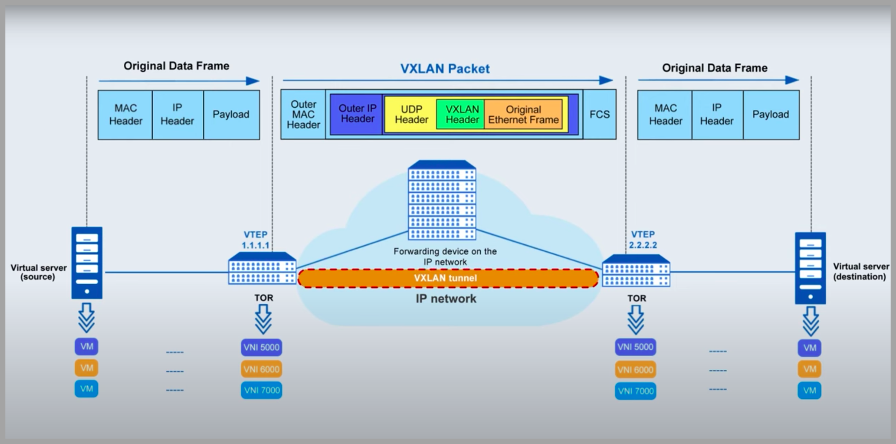

## P2 — Premiers pas avec VXLAN (2 routeurs, 2 hôtes) 🚚🛰️

### Objectifs
- Construire une petite topologie GNS3 avec **2 routeurs** et **2 hôtes** reliés par un **réseau VXLAN**.
- Comprendre ce qu’est VXLAN, à quoi servent les **VTEP**, le **VNI**, et la différence **overlay** / **underlay**.
- Savoir vérifier en ligne de commande que le tunnel fonctionne (tables MAC, interface `vxlanX`, paquets UDP/4789, etc.).

### Topologie (vue d’ensemble)
- 2 routeurs (ex: `routeur_wil-1` et `routeur_wil-2`).
- 1 lien « underlay » entre les routeurs (direct ou via un switch GNS3). Les interfaces côté underlay sont souvent `e0`.
- Chaque routeur a un hôte local branché sur `e1` (ex: `host_wil-1` ↔ `routeur_wil-1:e1`, `host_wil-2` ↔ `routeur_wil-2:e1`).
- Un **bridge** Linux (`br0`) par routeur, qui regroupe le port d’accès (`e1`) et l’interface **`vxlan10`** (VNI 10). Les deux hôtes se retrouvent alors dans le même **domaine L2 virtuel**.

---

## VXLAN expliqué simplement

### L2 vs L3 (trame vs paquet) 🧩
- Une **trame L2 (Ethernet)** contient des adresses **MAC**. Elle circule dans un **même segment** (même LAN / bridge).
- Un **paquet L3 (IP)** contient des adresses **IP** et traverse **plusieurs réseaux** grâce au routage.

### Pourquoi VXLAN ?
- Dans un datacenter, on veut parfois étirer un **LAN** (L2) entre des machines **éloignées**. Or, entre elles, il n’y a **pas** qu’un câble, mais souvent **un réseau IP (L3)**.
- **VXLAN** répond à ça: on **emballe** la trame L2 dans un **paquet UDP** (port 4789) pour la transporter **au‑dessus d’un réseau IP**. C’est l’analogie du **camion de déménagement**: on met l’objet (la trame) dans un carton (VXLAN/UDP/IP) pour traverser l’autoroute (underlay IP).

### Overlay vs Underlay 🛣️
- **Underlay**: le **réseau IP réel** qui relie nos routeurs (OSPF/BGP unicast, routes IP, MTU…). C’est l’autoroute physique.
- **Overlay (VXLAN)**: le **réseau virtuel L2** créé au‑dessus. C’est le camion qui transporte nos trames entre les sites.

### VTEP et VNI 🔑
- **VTEP (VXLAN Tunnel EndPoint)**: l’« ouverture du dépôt ». Chaque routeur/leaf possède un VTEP, identifié par une **IP source** (souvent une loopback ou l’IP underlay de `e0`).
- **VNI (VXLAN Network Identifier)**: un **numéro de réseau virtuel** (comme un VLAN ID sur 24 bits). Exemple ici: **VNI 10** → interface `vxlan10`.

### Encapsulation (qu’y a‑t‑il dans le paquet ?) 📦
Quand `host_wil-1` envoie une trame vers `host_wil-2`:
1) La trame Ethernet arrive sur `routeur_wil-1` (port d’accès `e1`), puis sur le bridge `br0`.
2) Le routeur encapsule la trame dans: `Ethernet/IP/UDP(4789)/VXLAN(VNI=10)/(trame Ethernet originale)`.
3) Le **paquet IP** est routé dans l’underlay jusqu’au **VTEP** de `routeur_wil-2`.
4) Le VTEP distant **décapsule** et réinjecte la **trame originale** dans son bridge `br0`, direction `host_wil-2`.



### BUM traffic (Broadcast / Unknown unicast / Multicast) 📣
- Si on ne connaît pas encore la MAC de destination, on **diffuse** (Broadcast) ou on inonde (Unknown unicast). 
- En VXLAN « multicast », les VTEP s’abonnent à un **groupe multicast** (ex: `239.1.1.1`) pour répliquer efficacement les BUM.
- En VXLAN « statique » (sans multicast), on peut répliquer **unicast** vers chaque VTEP connu.

### ECMP (bonus)
- L’underlay IP peut avoir **plusieurs chemins de même coût** entre VTEP. Le réseau peut alors **répartir** les flux VXLAN, améliorant **débit** et **tolérance aux pannes**.

### Points d’attention
- **MTU**: l’encapsulation ajoute ~50 octets; pense à augmenter la MTU de l’underlay si nécessaire.
- **Port 4789/UDP**: c’est le port par défaut de VXLAN.
- **Tables MAC (FDB)** côté bridge: on peut inspecter l’apprentissage des MAC locales/distant via `bridge fdb show`.

---

## Architecture des fichiers (P2/)
- `P2/router/…` : image et scripts du routeur (création de `br0`, de `vxlan10`, montée des interfaces, éventuellement FRR pour l’underlay).
- `P2/host/…` : image hôte simple (shell + utilitaires réseau pour faire des pings, arping, etc.).
- `P2/untitled/project-files/…` : fichiers internes GNS3 (interfaces, captures PCAP…).
- `Makefile` : cibles pour construire facilement les images.

Selon le script, côté routeur on retrouve typiquement:
- `ip link add br0 type bridge && ip link set br0 up` → bridge L2 local
- `ip link add vxlan10 type vxlan id 10 local <VTEP_IP> group 239.1.1.1 dev <UNDERLAY_IF> dstport 4789` → VXLAN multicast (ou sans `group` pour unicast/statique)
- `ip link set vxlan10 master br0` et `ip link set e1 master br0` → les deux ports sont dans le même domaine L2

---

## Lancer le projet (rapide)
1) Construire les images:
```bash
cd P2/
make
```
2) Ouvrir **GNS3**
3) « ▶ Lancer tous les services ». Ouvre les consoles.

### Vérifications utiles
Sur chaque routeur:
```bash
hostname
ip -br link | egrep 'br0|vxlan10|e0|e1'
ip -d link show vxlan10
bridge fdb show br0 | sort
```
Tu devrais voir `vxlan10` **UP**, lié à `br0`. En mode multicast: `group 239.1.1.1` apparaît dans `ip -d link show vxlan10`.

Sur les hôtes (après avoir mis des IP dans le même réseau L2):
```bash
ping <IP_de_l_hôte_d_en_face>
```

### Afficher la table MAC du bridge (exemples des captures)
```bash
# Sur chaque routeur
bridge fdb show br0
```
Tu verras des entrées MAC locales (sur `e1`) et éventuellement des entrées associées à `vxlan10` (MACs distantes apprises via le tunnel).

---

## Résumé pédagogique 📝
- VXLAN = **L2 au‑dessus de L3** grâce à **UDP/4789**. Les **VTEP** encapsulent/décapsulent; le **VNI** identifie le « VLAN virtuel ».
- **Underlay** assure la connectivité IP (routage) entre VTEP; **overlay** fournit le domaine L2 commun aux hôtes.
- Les commandes `ip -d link show vxlan10`, `bridge fdb show`, `ifconfig`, `vtysh` sont tes meilleurs amis pour comprendre et dépanner. 💡


